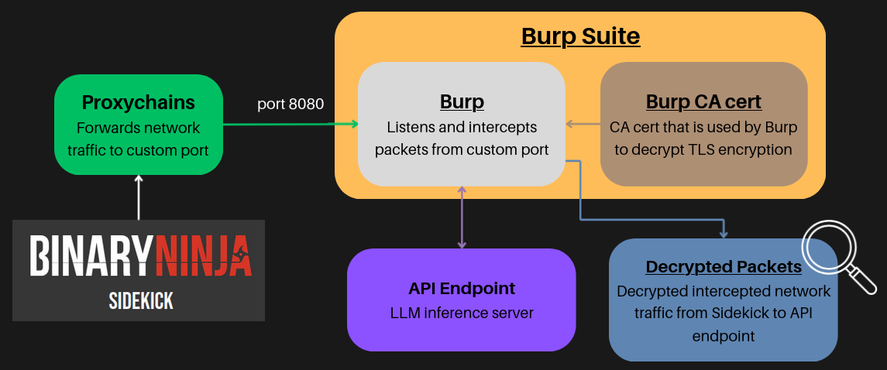
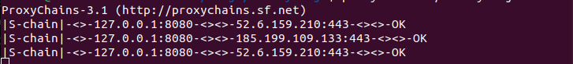
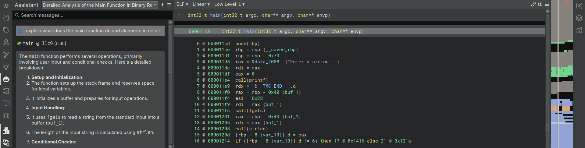
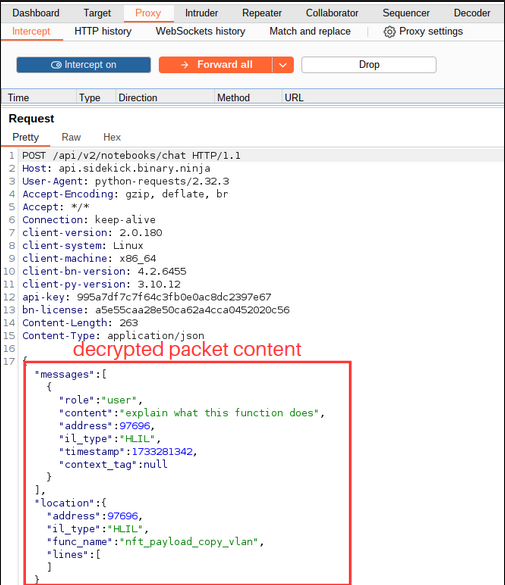

# Proxychains + Burp Suite 
## Introduction & Motivation
**Introduction**  
Sidekick relies on its own proprietary API endpoint LLM inference server.  
This Inference server is the backbone of Sidekicks' LLM based features.  
**Motivation:**  
To gain visibility into Sidekicks's API endpoint that supports its LLM based features.  
**Methodology:**  
The combination of proxychains and Burp Suite will be used to decrypt the network traffic packets from the Binary Ninja Client to the API Endpoint server.

## Setup
### Install Burp Suite Community Edition
Download Burp Suite:
``` 
https://portswigger.net/burp/releases/professional-community-2024-9-5?requestededition=community&requestedplatform=
```
Run Burp Suite installer:
```
# allow permissions to run this shell script  
chmod +x burpsuite_community_linux_v2024_9_5.sh  
# Run install shell script  
./burpsuite_community_linux_v2024_9_5.sh
```
### Configuring Burp Suite  
Navigate to `Proxy` --> `Proxy Settings`  
Under `Proxy listeners`, check that there is a port listening for traffic.  
You should see `127.0.0.1:8080` by default, indicating Burp Suite is listening to traffic passing through port 8080 on local device.  
Click `Edit` on this port  
Under `Request Handling`, enable `Support invisible proxying`
Click `Ok` to save
### Install proxychains
We need proxychains to forward the network traffic from Binja to port 8080 so that Burp Suite can capture the traffic  
Install proxychains:  
```
sudo apt install proxychains
```
Configure proxychains to forward traffic to port 8080:
```
cd /etc/  
sudo nano proxychains.conf
```
1. Comment out `proxy_dns`, stops DNS traffic from routing through proxy, since it is not important to our investigation.
2. Ensure `dynamic_chain` and `random_chain` are commented out, `strict_chain` is **NOT** commented out. Ensures that Strict Chaining is used so that all traffic packets from Binja is routed through port 8080 into Burp.  
3. At the bottom of the file, append `http 127.0.0.1 8080`. Ensures that proxychains is configured to route traffic through port 8080.    
4. Check that your proxychains.conf file is same as the one i have updloaded.  
### Configure Burp Suite CA certificate
We need Binja to use Burp Suite's CA certificate so that we can inspect and decrypt the network packets intercepted by Burp Suite
1. Export Burp Suite's CA Certificate: `Proxy` --> `Proxy Settings` --> `Proxy listeners` --> `Import/ export CA certificate` --> `Export Certificate in DER format` --> Save the CA certificate file as `cacert.der`  
2. Convert certificate to `.pem` using the code below: 
```
openssl x509 -inform DER -in cacert.der -out burp_cert.pem -text
sudo cp burp_cert.pem /usr/local/share/ca-certificates/burp_cert.crt
sudo update-ca-certificates
```
You should see `burp_cert.crt` file in your `/usr/local/share/ca-certificates` folder now.  
### Run Binary Ninja with proxychains
Navigate to where your Binary Ninja's ELF file is located in CLI.  
```
proxychains ./binaryninja
```
  
`Note: the IP addresses you observe might be different from the image above, that is to be expected.`  
Open Burp Suite, under `Proxy` --> `Intercept`, turn on `Intercept Off` --> `Intercept On`  
Open a file in Binary Ninja, then in sidekick Chat Bot Assistant, enter a prompt.  
In Burp Suite Application you should see a Request created.  
Click `Forward` button on Burp Suite.  
Inspect the contents of the request by clicking on it.  
**Note:**  
Now in Burp GUI, you should see some packets intercepted by Binary Ninja, even before you open any file.  
Those packets are Binary Ninja's attempt to connect to the Sidekick API endpoint server.  
Click the dropdown option beside the `Forward` in Burp GUI and change it to `Forward All`.  
Then forward all the packets to allow Binary Ninja to connect to Sidekick endpoint API.  
## Usage
1. In Binary Ninja GUI open any file.  
2. Click on any function and input any prompt into the chatbot.

3. In Burp you should now see a network traffic packet being sent.

4. **Go crazy!!**